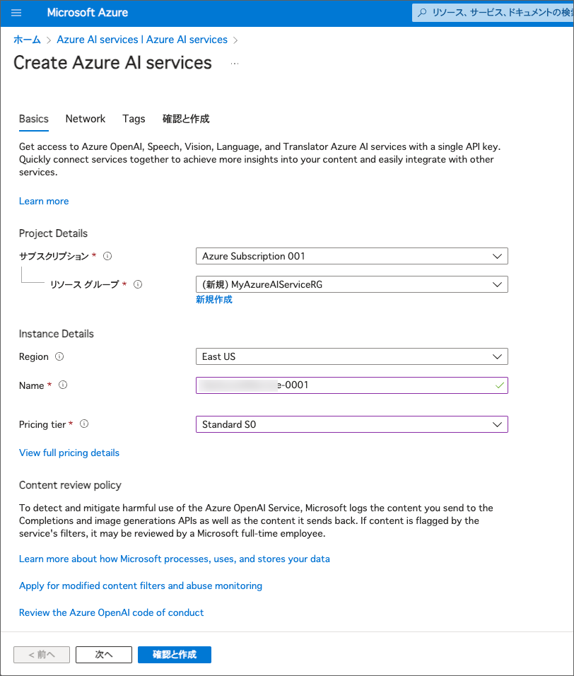

---
lab:
    title: 'Azure AI Service のセキュリティを管理する'
    module: 'Module 2 - Developing AI Apps with Azure AI Services'
---

# Azure AI サービスのセキュリティを管理する

セキュリティはどんなアプリケーションでも重要なポイントです。開発者として、Azure AI Service のようなリソースへのアクセスは必要な人だけに制限するようにしましょう。

Azure AI サービスへのアクセスは、通常、Azure AI Service のリソースを作成したときに生成される認証キーを使って制御されます。

## Visual Studio Code にリポジトリをクローンする

コードを開発するには、Visual Studio Code を使います。アプリのコードファイルは GitHub リポジトリに用意されています。

> **ヒント**: 既に **mslearn-ai-services** リポジトリをクローンしている場合は、それを Visual Studio Code で開いてください。そうでない場合は、以下の手順に従って開発環境にクローンしてください。

1. Visual Studio Code を起動します。
2. コマンドパレットを開きます（SHIFT+CTRL+P）し、**Git: Clone** コマンドを実行して `https://github.com/MicrosoftLearning/mslearn-ai-services` リポジトリをローカルフォルダにクローンします（フォルダはどこでも構いません）。
3. リポジトリがクローンされたら、そのフォルダを Visual Studio Code で開きます。
4. 必要に応じて、リポジトリ内の C# コードプロジェクトをサポートするための追加ファイルがインストールされるのを待ちます。
    > **注意**: ビルドとデバッグに必要なアセットを追加するように求められた場合は、**今は追加しない** を選択してください。

5. `Labfiles/02-ai-services-security` フォルダを展開します。

使いたい言語のフォルダを展開してください。C# と Python のコードが提供されています。

## Azure AI Services リソースを作成する

もしまだサブスクリプションに Azure AI Services のリソースが作られていない場合は、**Azure AI Services** リソースを新規で作成する必要があります。

1. `https://portal.azure.com` で Azure ポータルを開き、Azure サブスクリプションに関連付けられた Microsoft アカウントでサインインします。
2. 上部の検索バーで *Azure AI services* と入力して検索し、**Azure AI Services** を選択して、以下の設定で Azure AI Service マルチサービスアカウントリソースを作成します。
    - **サブスクリプション**: *自分の Azure サブスクリプション*
    - **リソースグループ**: *既存のリソースグループを選択するか新しいものを作成（制限付きのサブスクリプションを使用している場合、新しいリソースグループを作成する権限がない場合があります。その場合は提供されたものを使用してください）*
    - **Region**: *利用可能なリージョンを選択*
    - **Name**: *一意の名前を入力*
    - **Pricing tier**: Standard S0

3. 必要なチェックボックスを選択してリソースを作成します。
4. デプロイが完了するのを待ち、デプロイの詳細を確認します。

## 認証キーの管理

Azure AI サービスのリソースを作成すると、2つの認証キーが生成されます。これらのキーは、Azure ポータルや Azure コマンドラインインターフェイス (CLI) を使って管理できます。

1. 認証キーとエンドポイントを取得する方法を1つ選びます:

    ### Azure ポータルを使用する
    Azure ポータルで、Azure AI サービスのリソースに移動し、**キーとエンドポイント**ページを表示します。このページには、リソースに接続してアプリケーションから使用するために必要な以下の情報が含まれています。
    - クライアントアプリケーションがリクエストを送信できる HTTP *エンドポイント*。
    - 認証に使用できる2つの*キー*（クライアントアプリケーションはどちらのキーも使用できます。一般的な方法として、1つを開発用に、もう1つを本番用に使用します。開発者が作業を終えた後、開発用のキーを再生成してアクセスを防ぐことが簡単にできます）。
    - リソースがホストされている*場所*。これは一部のAPIリクエストに必要です（すべてのAPIではありません）。

    ### コマンドラインを使う
    代わりに、以下のコマンドを使ってAzure AIサービスのキーのリストを取得することもできます。Visual Studio Codeで新しいターミナルを開きます。その後、以下のコマンドを貼り付けます。*&lt;resourceName&gt;* をAzure AIサービスリソースの名前に、*&lt;resourceGroup&gt;* をリソースグループの名前に置き換えてください。
    ```
    az cognitiveservices account keys list --name <resourceName> --resource-group <resourceGroup>
    ```

    コマンドを実行すると、Azure AI サービスリソースのキーのリストが表示されます。キーは **key1** と **key2** の2つがあります。

    > **ヒント**: まだ Azure CLI にサインインしていない場合は、最初に `az login` を実行してアカウントにサインインしてください。

2. Azure AI サービスをテストするには、HTTPリクエスト用のコマンドラインツールである **curl** を使うことができます。**02-ai-services-security** フォルダ内の **rest-test.cmd** を開き、以下の **curl** コマンドを編集して、*&lt;yourEndpoint&gt;* と *&lt;yourKey&gt;* をあなたのエンドポイントURIと **Key1** キーに置き換えて、Azure AI サービスリソースのテキスト解析APIを使用します。
    ```bash
    curl -X POST "<yourEndpoint>/language/:analyze-text?api-version=2023-04-01" -H "Content-Type: application/json" -H "Ocp-Apim-Subscription-Key: <your-key>" --data-ascii "{'analysisInput':{'documents':[{'id':1,'text':'hello'}]}, 'kind': 'LanguageDetection'}"
    ```

3. 変更を保存します。ターミナルで "02-ai-services-security" フォルダに移動します。（**注意**: エクスプローラーで "02-ai-services-security" フォルダを右クリックし、*統合ターミナルで開く* を選択することでこれを行うことができます）。次に、以下のコマンドを実行します。
    ```
    ./rest-test.cmd
    ```
    コマンドは、入力データの言語（英語であるべき）に関する情報を含むJSONドキュメントを返します。

4. もしキーが漏洩したり、開発者がもうアクセスする必要がなくなった場合は、ポータルやAzure CLIを使ってキーを再生成できます。以下のコマンドを実行して、**key1** キーを再生成してください（*&lt;resourceName&gt;* と *&lt;resourceGroup&gt;* を自分のリソース名とリソースグループに置き換えてください）。

    ```
    az cognitiveservices account keys regenerate --name <resourceName> --resource-group <resourceGroup> --key-name key1
    ```
    Azure AI サービスリソースのキーのリストが表示されます。**key1** が前回取得したときから変更されていることを確認してください。

5. 古いキーを使って **rest-test** コマンドを再実行します（キーボードの **^** 矢印を使って以前のコマンドを表示できます）。これだと失敗することを確認してください。
6. **rest-test.cmd** の中の *curl* コマンドを編集し、新しい **key1** の値に置き換えて変更を保存します。その後、**rest-test** コマンドを再実行すると、成功することを確認してください。

> **ヒント**: この演習では、Azure CLI パラメーターのフルネーム（**--resource-group** など）を使用しました。コマンドを短くするために、**-g** のような短い代替も使用できます（ただし、少しわかりにくくなります）。Azure AI サービス CLI コマンドのパラメーターオプションについては、[Azure AI Services CLI コマンドリファレンス](https://docs.microsoft.com/cli/azure/cognitiveservices?view=azure-cli-latest)を参照してください。

## Azure Key Vault を使った安全なキーへのアクセス
Azure AI サービスを使うアプリケーションを開発する際、認証のためにキーを使う必要があります。しかしこの場合、開発したアプリケーションのコードからキーを取得できる必要があります。キーを環境変数や設定ファイルに保存する方法もありますが、これらの方法ではキーが不正アクセスにさらされる危険性があります。Azure でアプリケーションを開発する際には、キーを安全に Azure Key Vault に保存し、*マネージドID*（つまり、アプリケーション自体が使うユーザーアカウント）を通じてキーにアクセスする方法がより良いアプローチです。

### Key Vault を作成しシークレットを追加する

まず、キーコンテナー（キーを預けておくための入れ物）を作成し、Azure AI Service キーの*シークレット*を追加します。

1. Azure AI サービスリソースの **key1** の値をメモするか、クリップボードにコピーしてください。
2. Azure ポータルの **ホーム** ページで、**&#65291;リソースの作成** ボタンを選び、*Key Vault* を検索して、以下の設定で **Key Vault** リソースを作成します。
    - **基本** タブ
        - **サブスクリプション**: *あなたの Azure サブスクリプション*
        - **リソースグループ**: *Azure AI サービスリソースと同じリソースグループ*
        - **キーコンテナー名**: *一意の名前を入力*
        - **リージョン**: *Azure AI サービスリソースと同じリージョン*
        - **価格レベル**: Standard
    
    - **アクセス構成** タブ
        - **権限モデル**: Vault アクセスポリシー
        - **アクセス ポリシー** セクションまでスクロールし、左側のチェックボックスを使って自分のユーザーを選択します。その後、**確認および作成** を選び、**作成** を選んでリソースを作成します。

3. デプロイが完了するのを待ち、キーコンテナーリソースに移動します。
4. 左側のナビゲーションペインで、**シークレット**（オブジェクトセクション内）を選択します。
5. **+ 生成/インポート** を選択し、次の設定で新しいシークレットを追加します。
    - **アップロードオプション**: 手動
    - **名前**: AI-Services-Key *(後でこの名前を使ってシークレットを取得するコードを実行するため、正確に一致させることが重要です)*
    - **シークレット値**: *あなたの **key1** Azure AI サービスキー*
6. **作成** を選択します。

### サービスプリンシパルを作成する

To access the secret in the key vault, your application must use a service principal that has access to the secret. You'll use the Azure command line interface (CLI) to create the service principal, find its object ID, and grant access to the secret in Azure Vault.

1. Run the following Azure CLI command, replacing *&lt;spName&gt;* with a unique suitable name for an application identity (for example, *ai-app* with your initials appended on the end; the name must be unique within your tenant). Also replace *&lt;subscriptionId&gt;* and *&lt;resourceGroup&gt;* with the correct values for your subscription ID and the resource group containing your Azure AI services and key vault resources:

    > **Tip**: If you are unsure of your subscription ID, use the **az account show** command to retrieve your subscription information - the subscription ID is the **id** attribute in the output. If you see an error about the object already existing, please choose a different unique name.

    ```
    az ad sp create-for-rbac -n "api://<spName>" --role owner --scopes subscriptions/<subscriptionId>/resourceGroups/<resourceGroup>
    ```

The output of this command includes information about your new service principal. It should look similar to this:

    ```
    {
        "appId": "abcd12345efghi67890jklmn",
        "displayName": "api://ai-app-",
        "password": "1a2b3c4d5e6f7g8h9i0j",
        "tenant": "1234abcd5678fghi90jklm"
    }
    ```

Make a note of the **appId**, **password**, and **tenant** values - you will need them later (if you close this terminal, you won't be able to retrieve the password; so it's important to note the values now - you can paste the output into a new text file on your local machine to ensure you can find the values you need later!)

2. To get the **object ID** of your service principal, run the following Azure CLI command, replacing *&lt;appId&gt;* with the value of your service principal's app ID.

    ```
    az ad sp show --id <appId>
    ```

3. Copy the `id` value in the json returned in response. 
3. To assign permission for your new service principal to access secrets in your Key Vault, run the following Azure CLI command, replacing *&lt;keyVaultName&gt;* with the name of your Azure Key Vault resource and *&lt;objectId&gt;* with the value of your service principal's ID value you've just copied.

    ```
    az keyvault set-policy -n <keyVaultName> --object-id <objectId> --secret-permissions get list
    ```
### アプリケーションでサービスプリンシパルを使用する

これで、アプリケーションでサービスプリンシパルのIDを使用して、キーコンテナ内の秘密のAzure AIサービスキーにアクセスし、それを使ってAzure AIサービスリソースに接続できるようになりました。

> **Note**: In this exercise, we'll store the service principal credentials in the application configuration and use them to authenticate a **ClientSecretCredential** identity in your application code. This is fine for development and testing, but in a real production application, an administrator would assign a *managed identity* to the application so that it uses the service principal identity to access resources, without caching or storing the password.

1. In your terminal, switch to the **C-Sharp** or **Python** folder depending on your language preference by running `cd C-Sharp` or `cd Python`. Then run `cd keyvault_client` to navigate to the app folder.
2. Install the packages you will need to use for Azure Key Vault and the Text Analytics API in your Azure AI services resource by running the appropriate command for your language preference:

    **C#**

    ```
    dotnet add package Azure.AI.TextAnalytics --version 5.3.0
    dotnet add package Azure.Identity --version 1.12.0
    dotnet add package Azure.Security.KeyVault.Secrets --version 4.6.0
    ```

    **Python**

    ```
    pip install azure-ai-textanalytics==5.3.0
    pip install azure-identity==1.17.1
    pip install azure-keyvault-secrets==4.8.0
    ```

3. View the contents of the **keyvault-client** folder, and note that it contains a file for configuration settings:
    - **C#**: appsettings.json
    - **Python**: .env

    Open the configuration file and update the configuration values it contains to reflect the following settings:
    
    - The **endpoint** for your Azure AI Services resource
    - The name of your **Azure Key Vault** resource
    - The **tenant** for your service principal
    - The **appId** for your service principal
    - The **password** for your service principal

     Save your changes by pressing **CTRL+S**.
4. Note that the **keyvault-client** folder contains a code file for the client application:

    - **C#**: Program.cs
    - **Python**: keyvault-client.py

    Open the code file and review the code it contains, noting the following details:
    - The namespace for the SDK you installed is imported
    - Code in the **Main** function retrieves the application configuration settings, and then it uses the service principal credentials to get the Azure AI services key from the key vault.
    - The **GetLanguage** function uses the SDK to create a client for the service, and then uses the client to detect the language of the text that was entered.
5. Enter the following command to run the program:

    **C#**

    ```
    dotnet run
    ```

    **Python**

    ```
    python keyvault-client.py
    ```

6. When prompted, enter some text and review the language that is detected by the service. For example, try entering "Hello", "Bonjour", and "Gracias".
7. When you have finished testing the application, enter "quit" to stop the program.

## Clean up resources

If you're not using the Azure resources created in this lab for other training modules, you can delete them to avoid incurring further charges.

1. Open the Azure portal at `https://portal.azure.com`, and in the top search bar, search for the resources you created in this lab.

2. On the resource page, select **Delete** and follow the instructions to delete the resource. Alternatively, you can delete the entire resource group to clean up all resources at the same time.

## More information

For more information about securing Azure AI services, see the [Azure AI Services security documentation](https://docs.microsoft.com/azure/ai-services/security-features).
